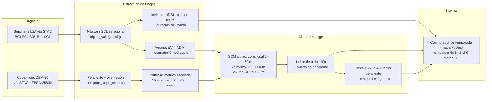

<div align="center">

# 🏔 Smart Natural Tourism Observatory — Alpine Edition (Sierra Nevada Pilot)

**Capa de inteligencia para la decisión en espacios naturales protegidos de alta montaña.** Código abierto, para uso académico.

De la teledetección Sentinel-2 a la decisión de inversión pública sobre el **Parque Nacional de Sierra Nevada** (Andalucía): innivación invernal, erosión estival de *borreguiles* por BTT y senderismo, atribución causal frente al clima, y traducción financiera TRAGSA para la administración pública (Junta de Andalucía, MITECO, Cetursa Sierra Nevada).

[](#7-tests)
[](https://www.python.org/)
[](https://github.com/soroushkarahrodi79-oss/snto-alpine/actions/workflows/ci.yml)
[](#1-estado-del-proyecto)
[](#1-estado-del-proyecto)
[](LICENSE)

🏗 [Arquitectura](ARCHITECTURE.md) · 🗺 [Hoja de ruta Alpine](docs/roadmap/alpine-v0.1.md) · 🌱 [Observatorio base (del que deriva)](https://github.com/soroushkarahrodi79-oss/snto-smart-tourism-observatory)

> ℹ️ **Edición derivada, versión 0.1.0.dev0.** Este repositorio es un *fork* del [observatorio base SNTO](https://github.com/soroushkarahrodi79-oss/snto-smart-tourism-observatory) y **reutiliza su motor** (EHS, SCM, DCS, capa temporal, persistencia, UI de 4 capas). No hereda su linaje de versiones (v1.0→v2.0), su DOI de Zenodo ni su despliegue en vivo — esos pertenecen al proyecto base. Este README describe **la Edición Alpina**; la relación con el motor heredado se detalla en [§10](#10-relación-con-el-observatorio-base).

</div>

---

## 🎯 El problema en una frase

Sierra Nevada afronta **dos amenazas espectralmente opuestas en el mismo macizo**: en invierno, el retroceso del manto nivoso por el cambio climático (clave para la resiliencia de la estación de esquí y del recurso hídrico); en verano, la erosión de los *borreguiles* —pastos húmedos de alta montaña sobre el límite arbóreo— bajo la presión del *mountain bike* y el senderismo. La Edición Alpina detecta ambas desde el satélite, **distingue el uso recreativo del forzamiento climático**, y traduce el hallazgo en una prioridad de inversión con coste TRAGSA y nivel de confianza.

> SNTO **no reemplaza** a ArcGIS, Google Earth Engine, Sentinel Hub, Tableau ni Power BI: se sitúa **por encima** de las plataformas GIS, de observación de la Tierra y de BI, y traduce su señal en decisiones de conservación defendibles.

---

## 📑 Índice

1. [Estado del proyecto](#1-estado-del-proyecto)
2. [Arquitectura de doble temporada](#2-arquitectura-de-doble-temporada)
3. [Módulos de la Edición Alpina](#3-módulos-de-la-edición-alpina)
4. [Stack tecnológico](#4-stack-tecnológico)
5. [Estructura del repositorio](#5-estructura-del-repositorio)
6. [Orden de ejecución](#6-orden-de-ejecución)
7. [Tests](#7-tests)
8. [Honestidad sobre limitaciones](#8-honestidad-sobre-limitaciones)
9. [Fundamento científico](#9-fundamento-científico)
10. [Relación con el observatorio base](#10-relación-con-el-observatorio-base)
11. [Fuentes y licencias de datos](#11-fuentes-y-licencias-de-datos)
12. [Licencia / uso académico](#12-licencia--uso-académico)

---

## 1. Estado del proyecto

`0.1.0.dev0` — **primera iteración, sin release cortada y sin validación de campo.** El versionado reinicia desde 0.x deliberadamente: es una línea de producto nueva. La madurez del **motor heredado** (arquitectura modular, backend persistente, UI por roles) es del observatorio base; la **adaptación alpina** está en fase de prototipo.

| Componente alpino | Estado |
|---|---|
| **Índices alpinos (NDSI + doble temporada)** — `src/features/alpine_spectral.py` | 🟡 Implementado y con tests. Verano usa la serie GEE real de 53 activos; invierno dispone de una capa real de febrero de 2024 para 43/53 activos. Falta cobertura multitesela y una serie NDSI multitemporal. |
| **Buffer de erosión escalado por pendiente** — `src/geospatial/alpine_dem.py` | 🟡 Implementado y con tests. Requiere DEM Copernicus vía STAC en ejecución real. |
| **SCM alpino (control emparejado por altitud)** — `src/spatial_causality/alpine_causality.py` | 🟡 Implementado y con tests. Evidencia `SIMULATED` hasta disponer de zonas reales. |
| **ROI público (TRAGSA × pendiente + socioeconómico)** — `src/risk_engine/public_roi.py` | 🟡 Implementado. Cifras socioeconómicas *proxy*, **no** INE/observadas. |
| **Dashboard alpino (pestaña de doble temporada)** — `src/platform/alpine_dashboard.py` + `src/ui/tabs/tab_alpine.py` | 🟡 Implementado y cableado con 53 activos; el mapa usa NDSI real parcial en invierno y pendiente para 53/53 en verano. Sin captura ni despliegue propios. |
| **Territorio Sierra Nevada registrado** — `src/config/territories.py` | ✅ `TerritoryConfig` real (bbox del macizo, teselas 30SVF/30SWF/30SVG/30SWG). |
| **Validación de campo** | ⛔ **No realizada.** Nada de la Edición Alpina está validado sobre el terreno. |

🟡 = implementado y verificado con tests (1.060 superados, 1 omitido), **no** validado en campo ni ejecutado sobre datos reales completos.

---

## 2. Arquitectura de doble temporada

Sierra Nevada plantea **dos problemas espectralmente opuestos en el mismo territorio**, y esa oposición estructura toda la edición:

| | **Invierno** | **Verano** |
|---|---|---|
| Problema | Retroceso del manto nivoso | Erosión de borreguiles por BTT y senderismo |
| La nieve es… | **la señal** | **ruido** |
| Índice | NDSI = (B03 − B11) / (B03 + B11) | EVI + NDMI |
| Máscara SCL | **conserva** la clase 11 | **descarta** la clase 11 |
| Salidas | Cota de nieve (m s.n.m.), duración del manto | Índice de degradación del suelo |

**La asimetría de máscara es el núcleo de la edición.** El motor base excluye la clase SCL 11 (nieve/hielo) como contaminación — correcto para un parque de media montaña, catastrófico para un índice de nieve: vaciaría la escena justo en los meses de interés. `src/features/alpine_spectral.py` define dos conjuntos de exclusión (`alpine_valid_mask`) y el conmutador estacional que elige entre ellos.

El agua se excluye en ambas temporadas: comparte la firma NDSI de la nieve (verde alto, SWIR bajo), y las lagunas glaciares están precisamente en la cota que determina la línea de nieve. Por eso `is_snow_pixel()` exige además un **suelo de reflectancia NIR** — la nieve sigue siendo reflectante en el infrarrojo cercano; el agua líquida no.

### Flujo por capas (Ingesta → Extracción → Riesgo → UI)



### Convención de scores: salud vs estrés (heredada del motor)

El sistema usa dos direcciones de score 0–100 y no deben mezclarse:

- **Health Score / EHS:** 0 = crítico, 100 = saludable. Convenio del dashboard, TPI, tiers y comunicación ejecutiva.
- **Stress Score / EHS operacional:** 0 = sin estrés, 100 = máxima degradación. Convenio de las columnas legacy del pipeline geoespacial.

La conversión oficial vive en `src.metrics.semantics`: `health = 100 − stress`.

> **Disciplina de evidencia.** Toda cifra socioeconómica es una estimación *proxy*, no una observación, y `PublicROIStatement` transporta su `EvidenceClass`. Conforme a la matriz de `src/platform/evidence.py`, una afirmación `SIMULATED` **no sostiene ninguna decisión de gasto por sí sola**. Nada en esta edición está validado en campo.

---

## 3. Módulos de la Edición Alpina

| Módulo | Aportación sobre el motor base |
|---|---|
| `src/features/alpine_spectral.py` | NDSI, máscara SCL estacional, discriminación nieve/agua (suelo NIR), cota de nieve, duración del manto, índice de degradación de borreguiles. Reutiliza `compute_evi`/`compute_ndmi` del módulo base sin redefinirlos. |
| `src/geospatial/alpine_dem.py` | **Escalado del corredor por magnitud de pendiente.** El buffer base calcula la pendiente y la descarta (`_, aspect_deg = ...`): conoce *hacia dónde* corre el agua, no *con cuánta fuerza*. Aquí el lado de aguas abajo pasa de 60 a 80 m entre 20° y 30°; el de aguas arriba se mantiene en 15 m, porque la escorrentía no sube. |
| `src/spatial_causality/alpine_causality.py` | **Zona de control emparejada por altitud.** El anillo base de 200–1000 m puede abarcar de pinar a roquedo periglaciar; atribuir ese gradiente altitudinal a los ciclistas es un error de bulto. El anillo se estrecha a 200–500 m y se intersecta con la banda del DEM ±50 m de la cota del sendero. La clasificación «roderas antropogénicas» exige exceso de degradación **y** puerta de pendiente. |
| `src/risk_engine/public_roi.py` | Tarifa TRAGSA de 15,50 €/m ajustada por pendiente (×1,0 → ×1,8, alta montaña) y traducida a empleos e ingresos hosteleros dependientes. Tarifa base centralizada en `src/config/constants.py`. |
| `src/platform/alpine_dashboard.py` | Constructores puros (sin Streamlit) del mapa PyDeck y la matriz TPI por temporada. |
| `src/ui/tabs/tab_alpine.py` | Superficie Streamlit: conmutador de temporada, mapa, simulador presupuestario (50 K–1 M €) y matriz TPI (TIER I–IV con distintivos de alerta). |

Ingesta NDSI y regeneración de la serie por sendero:

- `etl_raster_processor.py --territory sierra_nevada` transmite B03 + SCL y escribe `clean_S2_NDSI.tif`.
- `scripts/gee_templates_oapn/pn_sierra_nevada.js` incorpora B3/NDSI y una **máscara SCL estacional permisiva con la nieve** para regenerar la serie mensual de 53 activos en el GEE Code Editor.

---

## 4. Stack tecnológico

- **Lenguaje:** Python ≥ 3.12
- **Geoespacial:** rasterio, rasterstats, shapely, geopandas; pystac-client (STAC), Copernicus DEM GLO-30
- **Datos:** Sentinel-2 SR L2A (Copernicus); Google Earth Engine (`gee_adapter.py`, credenciales no incluidas)
- **CRS:** EPSG:25830 (ETRS89 / UTM 30N) para buffers y rásteres; EPSG:4326 para almacenamiento vectorial
- **Base de datos:** PostgreSQL / PostGIS (motor heredado)
- **API / dashboard:** FastAPI, uvicorn, Streamlit, pydeck (Deck.gl)
- **Persistencia:** SQLAlchemy 2.0 + Alembic (SQLite en dev/CI)
- **Análisis:** NumPy, pydantic; forecasting propio del motor (`src/forecasting/`)
- **Test / calidad:** pytest, pytest-cov, ruff
- **Infra:** Docker · GitHub Actions (CI)

---

## 5. Estructura del repositorio

Módulos **específicamente alpinos** marcados con 🏔; el resto es motor heredado.

```
snto-alpine/
├── README.md · ARCHITECTURE.md · requirements.txt · pyproject.toml
├── app.py                              # dashboard Streamlit (pestaña 🏔 alpina cableada)
│
├── etl_raster_processor.py             # 🏔 --territory sierra_nevada → NDSI + SCL
├── etl_raster_intersection.py          # 🏔 SNTO_TERRITORY=sierra_nevada → buffers escalados
│
├── scripts/gee_templates_oapn/
│   └── pn_sierra_nevada.js             # 🏔 plantilla GEE con NDSI + máscara estacional
│
├── src/
│   ├── features/
│   │   ├── spectral.py                 #    NDVI/NDMI/EVI (motor)
│   │   └── alpine_spectral.py          # 🏔 NDSI, máscara estacional, cota de nieve
│   ├── geospatial/
│   │   ├── geometry.py                 #    DEM STAC, slope/aspect, buffer asimétrico (motor)
│   │   └── alpine_dem.py               # 🏔 escalado del corredor por pendiente
│   ├── spatial_causality/
│   │   ├── analyzer.py                 #    SCM base
│   │   └── alpine_causality.py         # 🏔 control emparejado por altitud
│   ├── risk_engine/
│   │   └── public_roi.py               # 🏔 coste TRAGSA × pendiente + ROI socioeconómico
│   ├── platform/
│   │   ├── map_layers.py · charts.py   #    PyDeck + matriz TPI (motor)
│   │   └── alpine_dashboard.py         # 🏔 mapa y matriz por temporada
│   ├── ui/tabs/
│   │   └── tab_alpine.py               # 🏔 pestaña «Observatorio alpino»
│   ├── config/
│   │   ├── constants.py                # 🏔 constantes NDSI/ALPINE_/TRAGSA
│   │   └── territories.py              # 🏔 TerritoryConfig sierra_nevada
│   └── ...                             #    ingestion, time_series, decision_confidence,
│                                       #    territorial, intervention, socioeconomic, ... (motor)
│
├── tests/unit/
│   ├── test_alpine_pipeline.py         # 🏔 84 casos: NDSI, máscara, pendiente, atribución, ROI
│   └── test_alpine_dashboard.py        # 🏔 28 casos: rampas de color, deck, matriz, badges
│
└── clean_assets/timeseries/
    └── pn_sierra_nevada_gee_timeseries.csv   # 53 activos × 66 meses (GEE real; sin NDSI aún)
```

---

## 6. Orden de ejecución

```bash
pip install -r requirements.txt
cp .env.example .env
```

### Verano — salud del suelo de los borreguiles

```bash
# Rásteres NDVI/NDMI/EVI de una ventana estival
python etl_raster_processor.py --territory sierra_nevada --date-range "2024-07-01/2024-09-30"

# Buffers de erosión escalados por pendiente (DEM Copernicus vía STAC)
SNTO_TERRITORY=sierra_nevada python etl_raster_intersection.py
```

### Invierno — innivación

```bash
# NDSI + SCL de una ventana invernal (activa el modo alpino automáticamente)
python etl_raster_processor.py --territory sierra_nevada --date-range "2024-01-01/2024-03-31"
# → escribe clean_S2_NDSI.tif, clean_S2_SCL.tif, clean_S2_B03_green.tif
```

### Serie por sendero (opcional, regeneración GEE)

La capa ligera versionada `clean_assets/sierra_nevada_asset_layers.csv` contiene
NDSI de febrero de 2024 para 43/53 activos y pendiente para 53/53. Se genera con:

```bash
python scripts/build_alpine_asset_layers.py
```

Pega `scripts/gee_templates_oapn/pn_sierra_nevada.js` en [code.earthengine.google.com](https://code.earthengine.google.com) para regenerar `pn_sierra_nevada_gee_timeseries.csv` **con la columna `ndsi`** y construir la serie multitemporal que todavía falta.

### Dashboard

```bash
streamlit run app.py   # selecciona Sierra Nevada → pestaña «Observatorio alpino»
```

---

## 7. Tests

```bash
pytest -q
```

- **1.060 passing, 1 skipped, 0 regresiones** — incluye los casos propios de la edición alpina (`test_alpine_pipeline.py`, `test_alpine_dashboard.py`, `test_alpine_fixtures.py` y `test_alpine_asset_layers.py`) sobre la suite heredada, más los contratos de roadmap y aislamiento de despliegue.
- CI (`ci.yml`, GitHub Actions, Python 3.12 / Ubuntu): `ruff` bloqueante sobre los módulos mantenidos —**incluidos los alpinos**—, suite con cobertura ≥ 80 %, `mypy` y un job de PostgreSQL real. El despliegue Alpine es manual, tiene doble confirmación y está deshabilitado por defecto.
- Los tests corren **offline**: STAC (`pystac-client`), `rasterio` y `pydeck` se sustituyen por stubs; el DEM se simula con transforms `affine`.

---

## 8. Honestidad sobre limitaciones

La transparencia metodológica es parte del valor académico del proyecto.

- **Cobertura invernal parcial:** existe una capa NDSI real de febrero de 2024 para 43/53 activos; diez activos quedan fuera de la huella de la escena. Todavía no es una serie de duración del manto y debe completarse con mosaico multitesela y varias fechas.
- **Posición aproximada de los activos:** el NDSI y la pendiente se muestrean en centroide municipal + *jitter*, no sobre la traza real del sendero. Son valores indicativos, no de precisión topográfica; la sustitución por geometrías reales es el siguiente hito de datos.
- **Cifras socioeconómicas = escenario proxy:** empleos e ingresos de `public_roi.py` derivan de `visitor_capacity_annual` y de parámetros de literatura (22,50 €/visitante, 2.500 visitantes/empleo), **no** de observación INE/Andalucía. Toda salida lleva `EvidenceClass`; una `SIMULATED` no sostiene decisión de gasto por sí sola.
- **Coste TRAGSA de alta montaña:** la tarifa base de 15,50 €/m es de orden de magnitud (TRAGSA 2023); el **factor de pendiente ×1,0→×1,8 es un supuesto de planificación**, no una tarifa oficial de alta montaña publicada.
- **SCM alpino sin zonas reales:** la atribución roderas-vs-clima usa hoy zonas simuladas (`EvidenceClass.SIMULATED`). El emparejamiento por altitud requiere el DEM Copernicus en ejecución real.
- **Snapshot socioeconómico heredado:** el `src/socioeconomic/` heredado contiene municipios de la Comunidad de Madrid, **no de Andalucía**; el ROI alpino no lo usa (emplea proxies), pero la capa socioeconómica del motor no está re-abastecida para Sierra Nevada.
- **Sin validación de campo:** nada está contrastado sobre el terreno (penetrómetro, parcelas de cobertura, erosión medida). No se afirma validación.

---

## 9. Fundamento científico

**Innivación (invierno).** El NDSI (Normalized Difference Snow Index, Hall et al. 1995) explota que la nieve reflecta con fuerza en el verde (B03) y absorbe casi por completo en el SWIR (B11). El umbral operativo (NDSI ≥ 0,40) marca *candidatos* de nieve; el agua comparte esa firma, de ahí el suelo de reflectancia NIR para separarlas.

**Erosión estival (verano).** Cadena causal documentada: **pisoteo / rodadura recreativa → compactación del suelo → estrés hídrico → firma espectral medible** (caída de EVI y NDMI). En terreno con pendiente, la escorrentía concentra la energía erosiva y el penacho de sedimento viaja aguas abajo (Wemple et al. 2001), lo que justifica el corredor asimétrico escalado por pendiente y la **puerta de pendiente** de la atribución: en llano el uso compacta pero no abre roderas.

Referencias clave: Hall et al. (1995); Wemple et al. (2001); Roovers et al. (2004); Pickering & Mount (2010); Marion & Leung (2001); Cole & Monz (2002).

Marco regulatorio español aplicable: Ley 42/2007 (Patrimonio Natural y Biodiversidad), Ley 26/2007 (Responsabilidad Medioambiental), TRAGSA Tarifas 2023.

---

## 10. Relación con el observatorio base

La Edición Alpina **deriva** del [observatorio base SNTO](https://github.com/soroushkarahrodi79-oss/snto-smart-tourism-observatory) y **reutiliza su motor íntegro**: EHS operacional, SCM, DCS (data quality gate), TPI y tiers, capa temporal Sentinel-2, backend persistente (`src/persistence/`, `/api/v2`), y la UI de 4 capas de decisión (Decidir · Diagnosticar · Evidenciar · Gobernar). Ese motor fue desarrollado y demostrado sobre el **Parque Nacional Sierra de Guadarrama** y otros parques de la Red OAPN.

Lo que aporta esta edición es **únicamente la capa alpina** descrita en [§2](#2-arquitectura-de-doble-temporada) y [§3](#3-módulos-de-la-edición-alpina); la pestaña «Observatorio alpino» se añade como un módulo más dentro de la capa *Diagnosticar* del motor.

**No** heredan a este repositorio: el historial de releases del base (v1.0→v2.0), su DOI de Zenodo, ni su despliegue en vivo en Azure — pertenecen al proyecto base. La documentación técnica extendida del motor (whitepaper, ADRs, notas metodológicas) vive en el repositorio base.

---

## 11. Fuentes y licencias de datos

| Fuente | Proveedor | Licencia / condiciones | Atribución requerida |
|---|---|---|---|
| Sentinel-2 L2A (NDVI/NDMI/EVI/NDSI) | ESA / Copernicus | Datos abiertos Copernicus (uso libre con atribución) | *Contiene datos Copernicus Sentinel-2 modificados* |
| DEM GLO-30 (pendiente / orientación) | Copernicus | Datos abiertos Copernicus | *Copernicus DEM — producto ESA* |
| Cartografía de sendas y rutas BTT | OAPN (Red de Parques Nacionales) / OSM | Reutilización institucional con cita · ODbL | *Cartografía OAPN — P.N. Sierra Nevada* · *© OpenStreetMap contributors* |
| Cartografía ambiental y usos del suelo | Junta de Andalucía — REDIAM | Reutilización con cita | *REDIAM, Junta de Andalucía* |
| Padrón municipal, estadística de turismo | INE | Datos abiertos INE (reutilización con cita) | *Instituto Nacional de Estadística (INE)* |

El **código** se distribuye para **uso académico y de investigación**. Los **datos** pertenecen a sus proveedores y conservan sus licencias; este proyecto solo los reutiliza con la atribución indicada.

---

## 12. Licencia / uso académico

Proyecto de investigación académica desarrollado en la **Universidad Complutense de Madrid (UCM)**.

El código se distribuye para uso académico y de investigación con atribución. Ver [`LICENSE`](LICENSE). Los datos pertenecen a sus respectivos proveedores y conservan sus licencias (ver §11).

### Cómo citar

> ⚠️ **La Edición Alpina no tiene DOI propio todavía** (no se ha depositado en Zenodo). Los DOI `10.5281/zenodo.20818269` y `10.5281/zenodo.21472647` pertenecen al **observatorio base**, no a este repositorio; no los uses para citar la Edición Alpina. Mientras no exista depósito, cita este repositorio por su URL y *commit*.

Para citar el **marco base** del que deriva, ver el [observatorio base](https://github.com/soroushkarahrodi79-oss/snto-smart-tourism-observatory) y su DOI de Zenodo.

Fichero de cita: [`CITATION.cff`](CITATION.cff) · Contribuciones: [`CONTRIBUTING.md`](CONTRIBUTING.md)

---

<div align="center">
<sub>SNTO v0.1.0.dev0 · Python ≥ 3.12 · 1060 tests passing · agosto 2026</sub>
</div>
